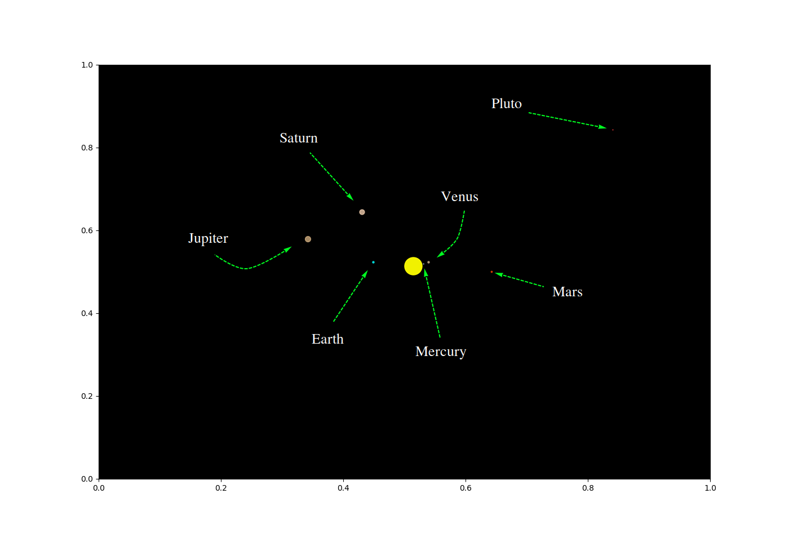

# Fys3150
Projects done in the course Computational Physics

[Link to projects](https://github.com/endrias34/FYS4150/)

  
If you are familiar with python there is a link below so you can download the code for  
the animation, and drag the picture around in different angles. You could then see the  
planets which we dont see here, Neptune and Uranus, and simulate it for a longer period.  
Descriptions of the planets and a "zoomed out" version down below.  

  

[3D Python simulation](https://github.com/endrias34/FYS4150/blob/master/src/Project-3/3D_Animation.zip)

  

  

